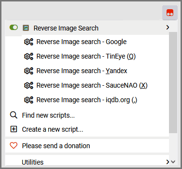

Reverse Image Search
====================

Right click an image and select "Open image in new tab", in the new tab press:

*  `Ctrl + G` for  [Google Images](https://images.google.com/)
*  `Ctrl + Q` for  [TinEye](https://tineye.com/)
*  `Ctrl + Y` for  [Yandex Images](https://yandex.com/images/)
*  `Ctrl + X` for  [SauceNAO - Reverse Image Search](https://saucenao.com/)
*  `Ctrl + ,` for  [iqdb.org - Multi-service image search](https://iqdb.org/)

Or go into the Tampermonkey menu on any website, and select the search service to search for the largest image on the page.

Install
=======

*  https://greasyfork.org/en/scripts/456818-reverse-image-search
*  https://openuserjs.org/scripts/cuzi/Reverse_Image_Search
